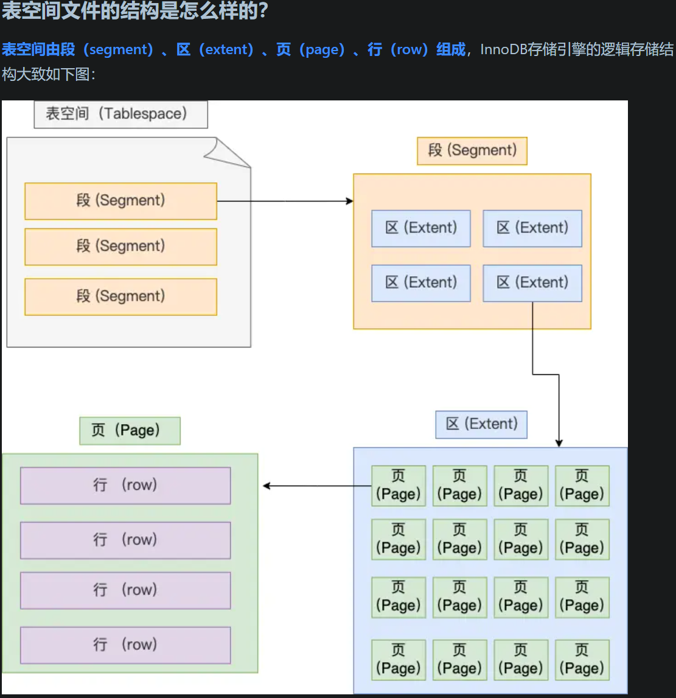

## MySQL 一行记录是怎么存储的？

InnoDB的数据是按 [页] 为单位来读写的，也就是说，当需要读一条记录的时候，并不是将这行记录从磁盘读出来，而是以页为单位，将其整体读到内存中。

默认每个页的大小为16KB，也就是最多能保证16KB的连续存储空间。

总之知道表中的记录存储在 [数据页] 里面就行。

每个区的大小为1MB，对于16KB的页来说，连续的64个页会被划分为一个区，使得链表中相邻的页物理位置也相邻，也就能使用顺序IO了